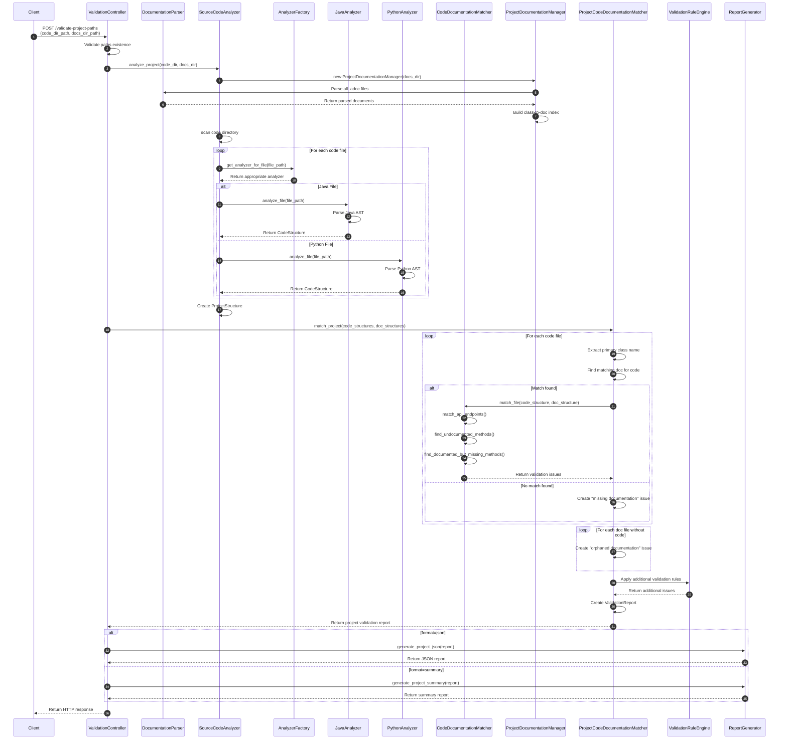

# AsciiDoc Validator

## Обзор системы

AsciiDoc Validator — это высокопроизводительный и расширяемый сервис для автоматической проверки документации в формате AsciiDoc. Проект призван упростить контроль качества технических документов, обеспечивая:

- **Синтаксическую валидацию** заголовков, списков, таблиц, блоков кода и ссылок по настраиваемым правилам
- **Парсинг и структурированный анализ** содержимого AsciiDoc-файлов
- **Валидацию относительно исходного кода** для обеспечения согласованности документации и кода
- **Генерацию детализированных отчётов** о найденных проблемах
- **Гибкую настройку** через YAML-конфигурации
- **Валидацию на уровне проекта** с автоматическим сопоставлением файлов кода и документации
- **Интеграцию с S3-совместимым хранилищем (MinIO)** — проверка существования бакетов и директорий, загрузка файлов документации из объектного хранилища

## Расширенная архитектура и компоненты

### Основные компоненты

```
.
├── app
│   ├── main.py                                   # Точка входа: настройка FastAPI
│   ├── config
│   │   ├── configuration_manager.py              # Управление конфигурацией
│   │   └── configuration_minio.py                # Конфигурация для S3
│   ├── controllers
│   │   └── validation_controller.py              # REST API контроллеры
│   ├── models
│   │   ├── validation_report.py                  # Модели отчетов валидации
│   │   ├── validation_rule.py                    # Модели правил валидации
│   │   ├── code_structure.py                     # Модели структуры кода
│   │   └── project_structure.py                  # Модели структуры проекта
│   ├── s3
│   │   └── client.py                             # Клиент для взаимодействия с S3
│   ├── services
│   │   ├── documentation_parser.py               # Парсер AsciiDoc
│   │   ├── project_documentation_manager.py      # Менеджер документации проекта
│   │   ├── report_generator.py                   # Генератор отчетов
│   │   ├── validation_rule_engine.py             # Движок правил валидации
│   │   ├── source_code_analyzer.py               # Анализатор исходного кода
│   │   ├── code_documentation_matcher.py         # Сопоставление кода и документации
│   │   ├── project_code_documentation_matcher.py # Сопоставление проекта и документации
│   │   ├── analyzers
│   │   │   ├── code_analyzer.py                  # Базовый интерфейс анализатора
│   │   │   ├── language_specific_analyzer.py     # Базовый класс для языковых анализаторов
│   │   │   ├── analyzer_factory.py               # Фабрика анализаторов
│   │   │   ├── java_analyzer.py                  # Анализатор Java кода
│   │   │   └── python_analyzer.py                # Анализатор Python кода
│   │   └── validators
│   │       └── syntax_validator.py               # Валидатор синтаксиса AsciiDoc
│   └── utils
│       └── logging_utils.py                      # Утилиты логирования
└── config                                        # Конфигурация
    ├── app_config.yaml                           # Настройки приложения
    └── validation_rules.yaml                     # Правила валидации
```

# Компоненты AsciiDoc Validator

## Основные компоненты

### Controllers
- **validation_controller.py** — REST API-контроллеры для валидации документации
  - Обрабатывает HTTP-запросы для различных типов валидации
  - Маршрутизирует запросы к соответствующим сервисам
  - Преобразует результаты валидации в HTTP-ответы в различных форматах

### Models
- **validation_report.py** — модели для отчетов валидации
  - `ValidationReport` — полный отчет о результатах валидации
  - `ValidationIssue` — модель для представления отдельной проблемы
  - `IssueType` — перечисление типов проблем (SYNTAX, SEMANTIC, COMPLETENESS, QUALITY)
  - `ValidationStatus` — перечисление статусов валидации (VALID, INVALID, PARTIALLY_CORRECTED и т.д.)

- **validation_rule.py** — модели для правил валидации
  - `ValidationRule` — модель правила валидации с параметрами конфигурации
  - `RuleType` — перечисление типов правил (SYNTAX, SEMANTIC, COMPLETENESS, QUALITY)

- **code_structure.py** — модели для представления структуры кода
  - `CodeStructure` — контейнер для структуры кода всего файла
  - `ClassInfo` — информация о классе (имя, методы, поля, модификаторы)
  - `MethodInfo` — информация о методе (имя, параметры, возвращаемый тип)
  - `ParameterInfo` — информация о параметре (имя, тип, обязательность)
  - `AnnotationInfo` — информация о декораторах/аннотациях
  - `LanguageType` — перечисление поддерживаемых языков программирования

- **project_structure.py** — модели для представления структуры проекта
  - `ProjectStructure` — общая структура проекта (код и документация)
  - `FileMapping` — сопоставление между файлами кода и документации
  
### Services

#### Core Services
- **documentation_parser.py** — парсер документации AsciiDoc
  - Валидирует синтаксис AsciiDoc
  - Преобразует документ в структурированное представление
  - Извлекает заголовки, разделы, блоки кода, списки и т.д.

- **validation_rule_engine.py** — движок правил валидации
  - Применяет правила валидации к распарсенной документации
  - Выявляет синтаксические и семантические проблемы
  - Генерирует отчеты о валидации

- **report_generator.py** — генератор отчетов
  - Создает JSON-отчеты о результатах валидации
  - Формирует краткие сводки для быстрого обзора
  - Специализированные отчеты для валидации проекта

- **s3/client.py** — клиент для взаимодействия с S3-совместимым хранилищем (MinIO):
   - Проверяет существование бакетов и «папок» (директорий)  
   - Загружает отдельные файлы и целые директории из бакетов в локальную временную папку  
   - Очищает временную директорию перед каждой загрузкой 

#### Code Analysis Services
- **source_code_analyzer.py** — анализатор исходного кода
  - Выбирает подходящий анализатор для файла по его расширению
  - Координирует процесс анализа кода директории или проекта
  - Создает унифицированное представление структуры кода

- **code_documentation_matcher.py** — сопоставитель кода и документации
  - Сопоставляет методы из кода с их описаниями в документации
  - Сравнивает параметры методов кода с документацией
  - Выявляет несоответствия и генерирует отчет о проблемах

- **project_documentation_manager.py** — менеджер документации проекта
  - Сканирует директорию с документацией, индексирует файлы
  - Создает карту соответствия классов и документации
  - Предоставляет быстрый доступ к документации по имени класса или файла

- **project_code_documentation_matcher.py** — сопоставитель проекта и документации
  - Сопоставляет целые директории с кодом и документацией
  - Выявляет недокументированные компоненты кода на уровне проекта
  - Генерирует комплексный отчет о валидации всего проекта

#### Analyzers
- **code_analyzer.py** — базовый интерфейс анализатора кода
  - Определяет общий API для всех анализаторов кода
  - Обеспечивает методы для анализа файлов и директорий
  - Предоставляет проверку поддержки языка

- **language_specific_analyzer.py** — базовый класс для языковых анализаторов
  - Расширяет базовый интерфейс для конкретных языков
  - Добавляет методы для работы с языково-специфичными особенностями
  - Обеспечивает общую логику для анализа директорий

- **analyzer_factory.py** — фабрика анализаторов
  - Регистрирует доступные анализаторы для различных языков
  - Выбирает подходящий анализатор по расширению файла или типу языка
  - Обеспечивает единую точку доступа к анализаторам

- **java_analyzer.py** — анализатор Java кода
  - Анализирует Java-код с помощью библиотеки javalang
  - Извлекает информацию о классах, методах, полях, аннотациях
  - Определяет REST API-эндпоинты через аннотации Spring

- **python_analyzer.py** — анализатор Python кода
  - Использует модуль ast для анализа Python-кода
  - Извлекает информацию о функциях, классах, методах, декораторах
  - Определяет API-эндпоинты через декораторы Flask/FastAPI

#### Validators
- **syntax_validator.py** — валидатор синтаксиса AsciiDoc
  - Проверяет корректность форматирования заголовков
  - Валидирует структуру блоков кода, списков, таблиц
  - Проверяет целостность ссылок и якорей

### Configuration
- **configuration_manager.py** — менеджер конфигурации
  - Загружает конфигурацию приложения и правила валидации из YAML-файлов
  - Предоставляет доступ к настройкам для других компонентов
  - Поддерживает сохранение измененной конфигурации


### configuration_minio.py — конфигурация подключения к MinIO
Модуль загружает параметры доступа к S3-совместимому хранилищу (MinIO) из переменных окружения:

```yaml
- MINIO_HOST         # адрес сервера MinIO, по умолчанию "localhost"
- MINIO_API_PORT     # порт API MinIO, по умолчанию "9000"
- MINIO_ACCESS_KEY   # ключ доступа, по умолчанию "minioadmin"
- MINIO_SECRET_KEY   # секретный ключ, по умолчанию "minioadmin"
- MINIO_USE_SSL      # использование SSL ("true"/"false"), по умолчанию "false"
```

Класс `MinioConfiguration.from_env()` читает эти переменные и формирует объект конфигурации, который используется при инициализации глобального клиента `minio_client`.

### Utils
- **logging_utils.py** — утилиты логирования
  - Настраивает логгеры для различных компонентов системы
  - Обеспечивает форматирование и ротацию логов
  - Предоставляет уровни логирования в соответствии с конфигурацией

## Взаимодействие компонентов

### Процесс валидации документации
1. `validation_controller` принимает HTTP-запрос с файлом документации
2. `documentation_parser` проверяет синтаксис и парсит документ
3. `validation_rule_engine` применяет правила валидации
4. `report_generator` формирует отчет о результатах
5. `validation_controller` возвращает результат клиенту

### Процесс валидации кода и документации
1. `validation_controller` принимает файлы кода и документации
2. `source_code_analyzer` с помощью подходящего анализатора парсит код
3. `documentation_parser` парсит документацию
4. `code_documentation_matcher` сопоставляет код и документацию
5. `report_generator` формирует отчет о несоответствиях
6. `validation_controller` возвращает результат клиенту

### Процесс валидации проекта
1. `validation_controller` принимает пути к директориям с кодом и документацией
2. `source_code_analyzer` рекурсивно анализирует код проекта
3. `project_documentation_manager` индексирует и парсит документацию
4. `project_code_documentation_matcher` выполняет сопоставление на уровне проекта
5. `report_generator` формирует структурированный отчет о проекте
6. `validation_controller` возвращает результат с группировкой по файлам

## Workflow



## Механизмы расширения

AsciiDoc Validator предоставляет несколько механизмов расширения:

1. **Добавление новых анализаторов языков** — создание классов, наследующих от `LanguageSpecificAnalyzer`
2. **Создание новых правил валидации** — определение правил в конфигурационных YAML-файлах
3. **Расширение отчетов** — кастомизация форматов и содержимого отчетов в `ReportGenerator`
4. **Интеграция с внешними системами** — через расширение контроллеров и добавление новых API-методов

Архитектура системы основана на принципах SOLID и паттернах проектирования, таких как Фабрика, Стратегия и Шаблонный метод, что обеспечивает гибкость и расширяемость всех компонентов.

## Принципы работы системы

### Базовая валидация документации (POST /api/v1/validate)

1. **Прием и проверка файла**
   - Получение файла AsciiDoc через endpoint `/api/v1/validate`
   - Проверка расширения файла (.adoc, .asciidoc)

2. **Синтаксический анализ**
   - Валидация синтаксиса AsciiDoc через `DocumentationParser.validate_syntax()`
   - При ошибках синтаксиса — возврат HTTP 400 с деталями

3. **Структурный анализ**
   - Парсинг документа в структурированное представление через `DocumentationParser.parse()`
   - Извлечение разделов, метаданных, оглавления

4. **Применение правил валидации**
   - Применение правил из конфигурации через `ValidationRuleEngine.validate()`
   - Генерация списка проблем различных типов (SYNTAX, SEMANTIC, COMPLETENESS, QUALITY)

5. **Формирование отчета**
   - Создание отчета о валидации через `ReportGenerator`
   - Возврат результата в формате JSON или summary

### Расширенная валидация с проверкой соответствия коду (POST /api/v1/validate-with-code)

1. **Прием и проверка файлов**
   - Получение файла документации (doc_file) и файла исходного кода (code_file)
   - Проверка расширений файлов

2. **Анализ документации**
   - Валидация синтаксиса AsciiDoc
   - Парсинг документа в структурированное представление

3. **Анализ исходного кода**
   - Определение языка программирования по расширению файла
   - Выбор соответствующего анализатора кода через `AnalyzerFactory`
   - Парсинг исходного кода в унифицированную структуру `CodeStructure`

4. **Сопоставление кода и документации**
   - Извлечение методов и параметров из кода (`CodeDocumentationMatcher._extract_code_methods()`)
   - Извлечение методов и параметров из документации (`CodeDocumentationMatcher._extract_doc_methods()`)
   - Сопоставление методов и выявление несоответствий

5. **Анализ соответствия API**
   - Извлечение API-эндпоинтов из кода (`CodeDocumentationMatcher._extract_code_endpoints()`)
   - Извлечение API-эндпоинтов из документации (`CodeDocumentationMatcher._extract_doc_endpoints()`)
   - Сопоставление API-эндпоинтов и выявление несоответствий

6. **Формирование комплексного отчета**
   - Объединение результатов синтаксической валидации и проверки соответствия
   - Возврат структурированного отчета с классификацией проблем

### Валидация проекта (POST /api/v1/validate-project-paths)

1. **Прием и проверка путей**
   - Получение путей к директориям с исходным кодом и документацией
   - Проверка существования указанных директорий

2. **Анализ структуры проекта**
   - Рекурсивное сканирование директории с исходным кодом
   - Определение языков программирования по расширениям файлов
   - Парсинг файлов в соответствующие структуры `CodeStructure`

3. **Анализ документации проекта**
   - Сканирование директории с документацией в формате AsciiDoc
   - Парсинг документов в структурированное представление
   - Создание индекса документации для быстрого поиска

4. **Сопоставление файлов кода и документации**
   - Использование нескольких стратегий сопоставления:
     - По имени класса, указанного в документации
     - По имени файла (без учета расширения)
     - По метаданным, включенным в документацию
   - Создание карты соответствия между файлами кода и документации

5. **Многоуровневая валидация**
   - Проверка наличия документации для всех файлов кода
   - Проверка наличия исходного кода для всех файлов документации
   - Для каждой пары "код-документация" выполнение детальной проверки соответствия
     - Сопоставление методов и функций
     - Сопоставление параметров
     - Сопоставление API-эндпоинтов

6. **Формирование комплексного отчета о проекте**
   - Группировка проблем по файлам и типам
   - Создание структурированного отчета с метаданными проекта
   - Возврат результата в формате JSON или summary

## Анализ исходного кода проекта

### Поддерживаемые языки программирования

- **Java** — полная поддержка классов, методов, аннотаций и Spring контроллеров
- **Python** — поддержка функций, классов, декораторов и Flask/FastAPI маршрутов
- **В разработке**: JavaScript, TypeScript, C#

### Процесс анализа кода

1. **Определение языка**
   - Анализ расширения файла (.java, .py, и т.д.)
   - Выбор соответствующего анализатора через `AnalyzerFactory`

2. **Парсинг кода**
   - Java: использование библиотеки `javalang` для создания AST
   - Python: использование модуля `ast` для парсинга кода

3. **Извлечение структуры**
   - Формирование унифицированного представления `CodeStructure`
   - Извлечение классов, методов, полей, параметров
   - Определение API-эндпоинтов через аннотации/декораторы

4. **Анализ API-контроллеров**
   - Java: анализ аннотаций Spring (@Controller, @RequestMapping, и т.д.)
   - Python: анализ декораторов Flask/FastAPI (@app.route, @app.get, и т.д.)

### Унифицированное представление кода

Все анализаторы генерируют структуру в едином формате `CodeStructure`, что обеспечивает единый интерфейс для валидации. Пример структуры Java-класса:

```json
{
  "metadata": {
    "language": "JAVA",
    "file_path": "src/main/java/com/example/UserController.java",
    "package": "com.example"
  },
  "classes": [
    {
      "name": "UserController",
      "documentation": "Controller for user management",
      "modifiers": ["public"],
      "methods": [
        {
          "name": "getUser",
          "documentation": "Returns user by ID",
          "modifiers": ["public"],
          "return_type": "User",
          "parameters": [
            {
              "name": "id",
              "type": "Long",
              "required": true
            }
          ],
          "annotations": [
            {
              "name": "GetMapping",
              "parameters": {
                "value": "\"/users/{id}\""
              }
            }
          ],
          "is_api_endpoint": true,
          "http_method": "GET",
          "path": "/users/{id}",
          "line_start": 42,
          "line_end": 45
        }
      ],
      "is_controller": true,
      "line_start": 15,
      "line_end": 85
    }
  ]
}
```

## Управление документацией проекта

### Менеджер документации проекта

`ProjectDocumentationManager` отвечает за:

1. **Сканирование директории с документацией**
   - Рекурсивный обход всех .adoc и .asciidoc файлов
   - Проверка синтаксиса перед парсингом
   - Обработка ошибок парсинга и логирование проблем

2. **Извлечение метаданных**
   - Определение имен классов из заголовков документов
   - Анализ содержимого для поиска ключевых идентификаторов
   - Создание индекса для быстрого доступа

3. **Сопоставление с кодом**
   - Поиск документации для файла кода по нескольким критериям
   - Извлечение документации для конкретного класса
   - Предоставление доступа к структуре документации для валидации

### Алгоритм сопоставления файлов

Сопоставление файлов кода и документации выполняется в несколько этапов:

1. **Поиск по имени класса**
   - Извлечение имени основного класса из файла кода
   - Поиск документации с упоминанием данного класса в заголовке или описании

2. **Поиск по имени файла**
   - Удаление расширений и приведение к нижнему регистру
   - Сопоставление базовых имен файлов (например, `Calculator.java` и `calculator.adoc`)

3. **Эвристический анализ**
   - Анализ содержимого документации для поиска упоминаний класса или методов
   - Использование частичного совпадения для обработки вариаций именования

4. **Построение индекса соответствия**
   - Создание карты соответствия `класс -> документация`
   - Обработка краевых случаев (несколько классов в одном файле, один документ для нескольких классов)

## Процесс валидации проекта

### Валидация на уровне проекта

`ProjectCodeDocumentationMatcher` осуществляет валидацию всей структуры проекта:

1. **Целостность проекта**
   - Выявление файлов кода без документации
   - Выявление файлов документации без соответствующего кода
   - Формирование отчета об общей структуре проекта

2. **Валидация пар "код-документация"**
   - Для каждой найденной пары запуск полной валидации через `CodeDocumentationMatcher`
   - Выявление несоответствий методов, параметров и API-эндпоинтов
   - Группировка результатов по файлам и типам проблем

3. **Построение дерева зависимостей**
   - Анализ импортов и зависимостей между файлами кода
   - Выявление потенциальных проблем в структуре документации
   - Предоставление рекомендаций по улучшению организации документации

### Типы выявляемых проблем

1. **Проблемы структуры проекта**
   - `COMPLETENESS-FILE-001`: Файл кода не имеет соответствующей документации
   - `SEMANTIC-FILE-001`: Документация описывает класс, отсутствующий в коде проекта

2. **Проблемы методов и функций**
   - `COMPLETENESS-METHOD-001`: Метод не описан в документации
   - `SEMANTIC-METHOD-001`: Метод описан в документации, но отсутствует в коде

3. **Проблемы параметров**
   - `COMPLETENESS-PARAM-001`: Параметр метода не описан в документации
   - `SEMANTIC-PARAM-001`: Несоответствие типа параметра в коде и документации
   - `SEMANTIC-PARAM-002`: Несоответствие обязательности параметра
   - `SEMANTIC-PARAM-003`: Параметр описан в документации, но отсутствует в коде

4. **Проблемы API-эндпоинтов**
   - `SEMANTIC-API-001`: API-эндпоинт не описан в документации
   - `SEMANTIC-API-002`: Несоответствие HTTP-метода в коде и документации
   - `SEMANTIC-API-003`: API-эндпоинт описан в документации, но отсутствует в коде

## API системы

### Базовая валидация документации

```bash
curl -X POST "http://localhost:8000/api/v1/validate" \
  -H "accept: application/json" \
  -H "Content-Type: multipart/form-data" \
  -F "file=@path/to/example.adoc" \
  -F "format=json"
```

### Расширенная валидация с проверкой соответствия коду

```bash
curl -X POST "http://localhost:8000/api/v1/validate-with-code" \
  -H "Content-Type: multipart/form-data" \
  -F "doc_file=@path/to/example.adoc" \
  -F "code_file=@path/to/Example.java" \
  -F "format=json"
```

### Валидация проекта по путям к директориям

```bash
curl -X POST "http://localhost:8000/api/v1/validate-project-paths" \
  -H "accept: application/json" \
  -H "Content-Type: multipart/form-data" \
  -F "code_dir_path=/path/to/project/src" \
  -F "docs_dir_path=/path/to/project/docs" \
  -F "format=json"
```

### Валидация проекта по загруженным файлам

```bash
curl -X POST "http://localhost:8000/api/v1/validate-project-files" \
  -H "accept: application/json" \
  -H "Content-Type: multipart/form-data" \
  -F "code_files=@/path/to/file1.java" \
  -F "code_files=@/path/to/file2.java" \
  -F "doc_files=@/path/to/doc1.adoc" \
  -F "doc_files=@/path/to/doc2.adoc" \
  -F "format=json"
```

## Форматы отчетов

### Отчет о валидации одного файла

```json
{
  "validation_id": "93c6c91d-8a86-4f52-b961-bd5bccbd07af",
  "documentation_source": "calculator.adoc",
  "timestamp": "2025-05-07T10:23:51.430794",
  "issues": [
    {
      "id": "COMPLETENESS-METHOD-001-1",
      "type": "COMPLETENESS",
      "location": {
        "section": "Документация для класса Calculator"
      },
      "issue": "Метод 'Calculator.divide' не описан в документации"
    },
    {
      "id": "SEMANTIC-PARAM-003-1",
      "type": "SEMANTIC",
      "location": {
        "line": 35,
        "section": "Метод add"
      },
      "issue": "Параметр 'c' метода 'add' описан в документации, но отсутствует в коде. Возможно, это устаревшая документация или ошибка генерации LLM."
    }
  ],
  "corrections": [],
  "summary": {
    "total_issues": 2,
    "corrected_issues": 0,
    "skipped_issues": 0
  },
  "status": "INVALID"
}
```

### Отчет о валидации проекта

```json
{
  "validation_id": "5f7e9a27-3d1a-4cf8-8b0d-8c77d71e0d7f",
  "project_validation": true,
  "timestamp": "2025-05-13T14:23:51.430794",
  "summary": {
    "total_issues": 5,
    "corrected_issues": 0,
    "skipped_issues": 0,
    "status": "INVALID",
    "total_files": 3
  },
  "files": [
    {
      "file_path": "Calculator.java | calculator.adoc",
      "issues_count": 2,
      "issues": [
        {
          "id": "COMPLETENESS-METHOD-001-1",
          "type": "COMPLETENESS",
          "location": {
            "section": "Документация для класса Calculator"
          },
          "issue": "[Calculator.java | calculator.adoc] Метод 'Calculator.divide' не описан в документации",
          "original_content": null,
          "corrected_content": null,
          "rule_applied": null
        },
        {
          "id": "SEMANTIC-PARAM-003-1",
          "type": "SEMANTIC",
          "location": {
            "line": 35,
            "section": "Метод add"
          },
          "issue": "[Calculator.java | calculator.adoc] Параметр 'c' метода 'add' описан в документации, но отсутствует в коде. Возможно, это устаревшая документация или ошибка генерации LLM.",
          "original_content": null,
          "corrected_content": null,
          "rule_applied": null
        }
      ]
    },
    {
      "file_path": "UserController.java",
      "issues_count": 1,
      "issues": [
        {
          "id": "COMPLETENESS-FILE-001-3",
          "type": "COMPLETENESS",
          "location": {},
          "issue": "Файл кода 'UserController.java' не имеет соответствующей документации",
          "original_content": null,
          "corrected_content": null,
          "rule_applied": null
        }
      ]
    },
    {
      "file_path": "discount_calculator.adoc",
      "issues_count": 1,
      "issues": [
        {
          "id": "SEMANTIC-FILE-001-1",
          "type": "SEMANTIC",
          "location": {},
          "issue": "Документация 'discount_calculator.adoc' описывает класс 'DiscountCalculator', который отсутствует в коде проекта",
          "original_content": null,
          "corrected_content": null,
          "rule_applied": null
        }
      ]
    }
  ]
}
```

### Формат краткой сводки

```json
{
  "status": "INVALID",
  "total_issues": 5,
  "is_valid": false,
  "files_with_issues": 3,
  "issues_by_type": {
    "COMPLETENESS": 2,
    "SEMANTIC": 3
  }
}
```

## Расширение и настройка системы

### Добавление поддержки новых языков программирования

Система поддерживает расширение для анализа новых языков. Для добавления языка необходимо:

1. **Создать новый анализатор**:
   ```python
   # app/services/analyzers/javascript_analyzer.py
   from services.analyzers.language_specific_analyzer import LanguageSpecificAnalyzer
   from models.code_structure import LanguageType

   class JavaScriptAnalyzer(LanguageSpecificAnalyzer):
       def __init__(self):
           super().__init__(LanguageType.JAVASCRIPT, ["js"])
           
       # Реализация методов анализа JavaScript
   ```

2. **Зарегистрировать анализатор в фабрике**:
   ```python
   # app/services/analyzers/__init__.py
   from services.analyzers.javascript_analyzer import JavaScriptAnalyzer
   
   analyzer_factory.register_analyzer(LanguageType.JAVASCRIPT, JavaScriptAnalyzer)
   ```

3. **Добавить языковые правила в конфигурацию**:
   ```yaml
   # config/validation_rules.yaml
   - id: COMPLETENESS-JS-METHOD-001
     name: JavaScript Method documentation completeness
     description: |
       Убедиться, что каждая функция JavaScript задокументирована в AsciiDoc.
     type: COMPLETENESS
     severity: ERROR
     config:
       # Специфичные для JavaScript правила
   ```

### Настройка собственных правил валидации

Система поддерживает создание пользовательских правил валидации:

```yaml
# custom_rules.yaml
- id: QUALITY-DOC-001
  name: Documentation Quality Check
  description: |
    Проверка качества документации на наличие подробных примеров.
  type: QUALITY
  severity: WARNING
  config:
    require_examples: true
    min_examples_count: 1
    examples_patterns:
      - "### Пример"
      - "## Пример использования"
      - "```"
```

## Заключение

AsciiDoc Validator представляет собой мощный инструмент для обеспечения качества технической документации как на уровне отдельных файлов, так и на уровне всего проекта. Новые возможности валидации проекта позволяют:

1. **Автоматически сопоставлять файлы кода и документации**, даже если они имеют разные имена или расположены в разных директориях
2. **Выявлять недокументированные компоненты** кода, такие как классы, методы, параметры и API-эндпоинты
3. **Обнаруживать устаревшую документацию**, описывающую несуществующий код или параметры
4. **Контролировать согласованность структуры** между кодом проекта и его документацией
5. **Интегрироваться с CI/CD системами** для непрерывного контроля качества документации

Гибкая архитектура системы позволяет легко расширять поддержку новых языков программирования и форматов документации, а настраиваемые правила валидации обеспечивают адаптацию к различным стилям и требованиям проектов.